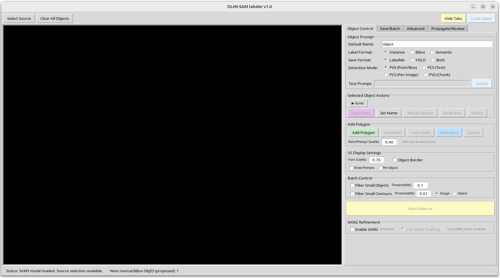
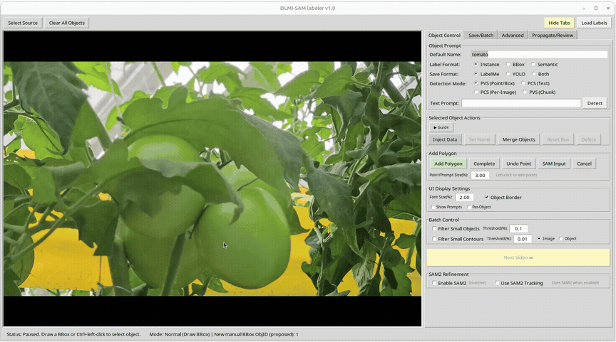

# DLMI-SAM Auto Labeler

Interactive GUI tool for semi-automatic video/image segmentation and annotation, powered by [SAM 3 (Segment Anything Model 3)](https://github.com/facebookresearch/sam3) from Meta AI. Supports point/box prompts, polygon input, text-conditioned detection (PCS), and frame-by-frame mask propagation to produce LabelMe-compatible annotations.


## Installation

```bash
git clone https://github.com/chickencoin2/DLMI_SAM.git
cd DLMI_SAM

python -m venv venv
source venv/bin/activate

pip install -r requirements.txt
```

> **Note:** `requirements.txt` installs PyTorch with CUDA 12.8 support by default. For other CUDA versions, see [PyTorch - Get Started](https://pytorch.org/get-started/locally/) and modify the `--extra-index-url` line accordingly.

> **Note:** This project requires the `transformers` library with SAM3 model support. The `requirements.txt` pins a specific commit (`3a8d291`) that is verified to work correctly. Some other versions of `transformers` may fail due to typos or incomplete SAM3 support. If you install a different version, make sure it includes working `Sam3VideoModel`, `Sam3TrackerVideoModel`, and `Sam3Model` classes.

## Usage

```bash
python app.py
```

> **Note:** The first launch may take tens of seconds or more for SAM3 model loading.

On launch, the initial screen appears as shown below. The left side is the video display area, and the right side is the control panel.



1. Click **Select Source** to choose a video file
2. In the Object Control tab, select the prompt mode and the object name to be labeled
3. Enter prompts on the video to perform segmentation
4. Use the **Propagate/Review** tab to propagate masks across all frames
5. Review the results and save as LabelMe JSON or YOLO format

Below is an example of segmentation and propagation in action:




## License

This project is licensed under the [Apache License 2.0](https://www.apache.org/licenses/LICENSE-2.0).

## Acknowledgements

This project is built on top of **SAM 3 (Segment Anything Model 3)** by Meta AI, accessed via the [Hugging Face Transformers](https://github.com/huggingface/transformers) library.

If you use SAM 3, please cite the original work:

```bibtex
@misc{carion2025sam3segmentconcepts,
  title={SAM 3: Segment Anything with Concepts},
  author={Nicolas Carion and Laura Gustafson and Yuan-Ting Hu and Shoubhik Debnath and Ronghang Hu and Didac Suris and Chaitanya Ryali and Kalyan Vasudev Alwala and Haitham Khedr and Andrew Huang and Jie Lei and Tengyu Ma and Baishan Guo and Arpit Kalla and Markus Marks and Joseph Greer and Meng Wang and Peize Sun and Roman Rädle and Triantafyllos Afouras and Effrosyni Mavroudi and Katherine Xu and Tsung-Han Wu and Yu Zhou and Liliane Momeni and Rishi Hazra and Shuangrui Ding and Sagar Vaze and Francois Porcher and Feng Li and Siyuan Li and Aishwarya Kamath and Ho Kei Cheng and Piotr Dollár and Nikhila Ravi and Kate Saenko and Pengchuan Zhang and Christoph Feichtenhofer},
  year={2025},
  eprint={2511.16719},
  archivePrefix={arXiv},
  primaryClass={cs.CV},
  url={https://arxiv.org/abs/2511.16719},
}
```

## Citation

If you use this labeling tool in your research, please cite our manuscript currently under review. The citation information provided below is a temporary placeholder and will be updated with the formal publication details upon acceptance.

```bibtex
@article{sim2026dlmisam,
  title={DLMI-SAM: Direct Latent Memory Injection for Robust Human-in-the-Loop Instance Segmentation Labeling},
  author={Sim, Myongbo and Seo, Dasom and Baek, Na Rae},
  journal={Under review at Computers and Electronics in Agriculture},
  year={2026},
  url={[https://github.com/chickencoin2/DLMI_SAM](https://github.com/chickencoin2/DLMI_SAM)}
}
